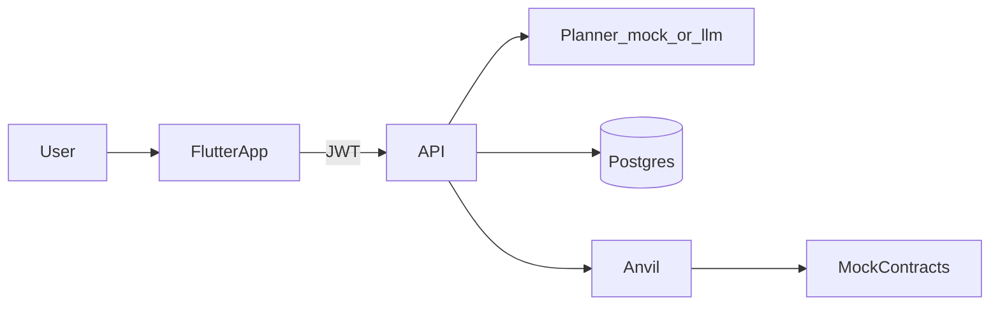

# IntentGuard

Natural-language DeFi intent → schema-validated multi-step plan → per-step human approval → execute against Foundry mocks on Anvil. The LLM (or mock planner) is untrusted; nothing hits the chain without schema, policy, and a human approve.

## Layout

```text
apps/mobile/          Flutter client (Bloc, Dio, go_router)
services/api/         Go API (auth, intents, planner, policy, executor)
packages/plan-schema/ Plan JSON Schema v1 + Go validate
contracts/            MockERC20 + MockSwapRouter (Foundry)
evals/                Accept/reject fixtures
deploy/               Docker Compose (API + Postgres + Anvil)
docs/                 Architecture, threat model, demo script
```

## Architecture



Details: [`docs/architecture.md`](docs/architecture.md). Threat notes: [`docs/threat-model.md`](docs/threat-model.md).

## Run locally

```bash
cd deploy && docker compose up --build
```

In another shell (Foundry on the host):

```bash
./scripts/deploy-anvil.sh
./scripts/seed-anvil.sh
```

API `:8080`, Anvil `:8545`. Full curl path: [`docs/demo-script.md`](docs/demo-script.md).

Mobile:

```bash
cd apps/mobile
flutter run --dart-define=API_BASE=http://127.0.0.1:8080
```

## Env (API)

| Var | Default / notes |
|-----|-----------------|
| `DATABASE_URL` | required |
| `JWT_SECRET` | required |
| `PLANNER_MODE` | `mock` (CI/compose); `llm` needs `LLM_API_KEY` |
| `LLM_BASE_URL` | `https://api.openai.com/v1` |
| `LLM_MODEL` | `gpt-4o-mini` |
| `CHAIN_RPC_URL` | `http://127.0.0.1:8545` |
| `EXECUTOR_PRIVATE_KEY` | Anvil account #0 — local demo only |
| `DEPLOYMENTS_PATH` | `contracts/deployments/anvil.json` |

See [`services/api/README.md`](services/api/README.md).

## Tests / CI

```bash
cd contracts && forge test
cd services/api && go test ./...
cd services/api && go run ./cmd/evals -dir ../../evals/cases
cd apps/mobile && flutter test
```

GitHub Actions runs the same gates on PRs (`.github/workflows/ci.yml`).

## Branches

- `develop` — integration line for day-to-day work
- `main` — milestone snapshots only (M1 auth, M2 execution, M3 MVP). Prefer `main` / `v0.1.0` for demos.

## Design notes

- Plan actions v1: `approve`, `swap`, `transfer` only.
- Policy: spend cap, token/spender/recipient allowlists, max steps, slippage bound.
- Executor ABI-encodes stored step JSON — never raw model hex.
- Mock planner fixtures cover accept + schema/policy reject paths for demos and evals.
