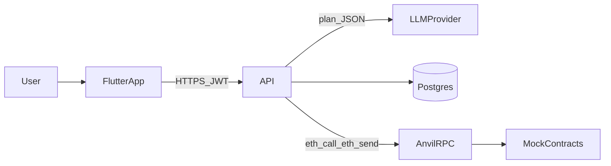
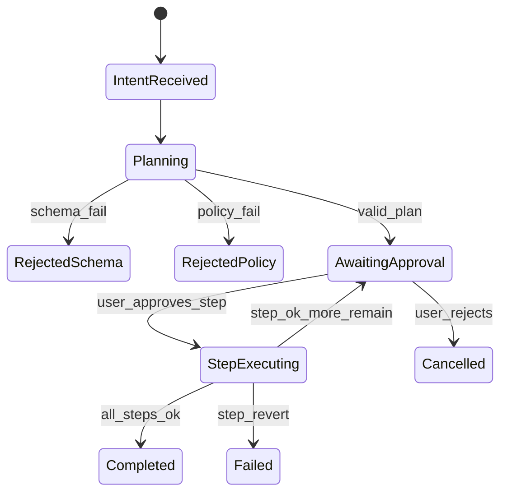

# Architecture

IntentGuard turns a natural-language intent into a schema-validated multi-step plan, requires per-step human approval, then executes against Foundry mocks on Anvil.

## Context

## Plan lifecycle

## Components

| Area | Role |
|------|------|
| `apps/mobile` | Auth, intent composer, plan review, history, demo balances |
| `services/api` | JWT auth, intents, planner, policy, step approve/execute |
| `packages/plan-schema` | Plan JSON Schema v1 + Go validation |
| `contracts` | `MockERC20`, `MockSwapRouter` on Anvil |
| `evals` | Accept/reject fixtures for mock planner + policy |
| `deploy` | Compose: Postgres + Anvil + API |

## Planner

- Interface: `Planner.Plan(ctx, intentText) → Plan`
- Default: `PLANNER_MODE=mock` (deterministic fixtures, CI-safe)
- Optional: `PLANNER_MODE=llm` with `LLM_API_KEY` (OpenAI-compatible)
- Model output is untrusted: schema validate → policy check → human approve → ABI encode from stored step payload

## Trust boundaries

| Zone | Trust |
|------|-------|
| LLM / mock planner output | Untrusted |
| Flutter client | Untrusted (server authorizes by user + plan id) |
| API + policy + schema | Trusted compute |
| Anvil private key | Local demo only |
| Mock contracts | Trusted fixtures you control |

## Data flow (happy path)

1. Client `POST /intents` with intent text (JWT).
2. Planner returns Plan JSON; API validates schema and policy.
3. Plan persists as `awaiting_approval` with pending steps.
4. Client loads `GET /plans/{id}`; user approves step 0…n in order.
5. Executor ABI-encodes the stored step, sends tx on Anvil, records hash/status.
6. When all steps succeed, plan is `completed`.
